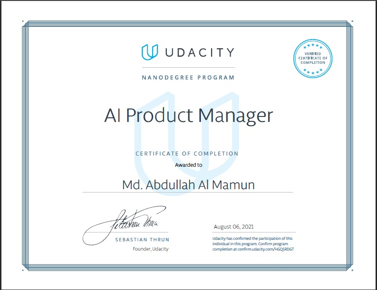

# AI Product Manager

You’ll learn how to evaluate the business value of an AI product. You’ll start by building familiarity and fluency with common AI concepts. You’ll then learn how to scope and build a data set, train a model, and evaluate its business impact. Finally, you’ll learn how to ensure a product is successful by focusing on scalability, potential biases, and compliance. Along the way, you’ll review case studies and examples to help you focus on how to define metrics to measure the business value for a proposed product.

### Successfully graduated in AI Product Manager Nanodegree Program.

## Projects

I am sharing my project files with you for learning purpose. Please don't abuse them. Udacity authorities will verify your work to full their code of conduct.

[Create Dataset](https://github.com/mamuncseru/ai-product-manager/tree/main/Creating%20Dataset%20Project)
[Building model with AUTOML](https://github.com/mamuncseru/ai-product-manager/tree/main/Building%20a%20Model%20with%20AutoML%20Project)
[Capstone](https://github.com/mamuncseru/ai-product-manager/tree/main/Capstone%20Project)
